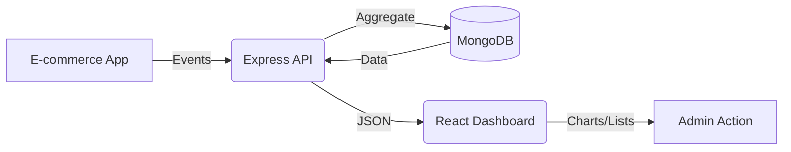

# 🚀 E-Commerce Customer Churn Analytics Platform

[](https://nodejs.org/)
[](https://reactjs.org/)
[](https://www.mongodb.com/)
[](https://expressjs.com/)
[](https://vitejs.dev/)
[](https://tailwindcss.com/)

> **The ultimate production-grade solution for real-time customer behavior tracking and churn prediction.**

---

## 🌟 Project Vision

"Empowering e-commerce enterprises with actionable data-driven insights to proactively mitigate customer churn and maximize lifetime value through advanced behavioral analytics and predictive modeling."

---

## 🏗️ Architecture & Workflow

This project is a full-stack monorepo consisting of a high-performance **Express API** and a modern **React Dashboard**.

### **Data Flow & User Journey**
1.  **Ingestion**: Customer activity (transactions, login frequency, support calls) is captured via the REST API.
2.  **Processing**: The server calculates complex KPIs like **Churn Probability** and **LTV** using the MongoDB Aggregation Framework.
3.  **Visualization**: The React frontend retrieves this data and renders interactive charts (Recharts) and dynamic tables.
4.  **Action**: Admins identify high-risk customers and take proactive retention measures.



---

## 📂 Project Structure

| Component | Path | Description |
| :--- | :--- | :--- |
| **Backend** | [`/server`](./server) | Node.js API with Mongoose, JWT, and Joi validation. |
| **Frontend** | [`/client`](./client) | React 19 Dashboard with Redux Toolkit and Framer Motion. |
| **API Docs** | [`Postman`](./Customer%20Churn%20Analytics%20API.postman_collection.json) | Full API collection for testing and integration. |

---

## ✨ Key Features

-   👤 **Advanced User Management**: RBAC (Role-Based Access Control) with secure JWT sessions.
-   📊 **Real-time Analytics**: Dynamic calculation of retention rates and churn probability.
-   📈 **Predictive Scoring**: Algorithm-driven risk assessment based on activity patterns.
-   🎨 **Modern UI**: Dark/Light mode, responsive design, and smooth animations.
-   🛡️ **Enterprise Security**: Password hashing, input sanitization, and CORS protection.

---

## 🚀 Quick Start

### 1. Prerequisites
- Node.js (v18+)
- MongoDB (Local or Atlas)

### 2. Installation

```bash
# Clone the repository
git clone https://github.com/rachitkakkad/ecommerce-customer-churn-analytics-api.git
cd ecommerce-customer-churn-analytics-api

# Setup Backend
cd server && npm install
cp .env.example .env # Update with your MONGO_URI

# Setup Frontend
cd ../client && npm install
```

### 3. Running the App

**Start Backend:**
```bash
cd server
npm run dev
```

**Start Frontend:**
```bash
cd client
npm run dev
```

---

## 🛠️ Tech Stack

### **Frontend**
- **Framework**: React 19 + Vite
- **State**: Redux Toolkit
- **Styling**: Tailwind CSS + Framer Motion
- **Charts**: Recharts
- **Icons**: Lucide React

### **Backend**
- **Runtime**: Node.js
- **Framework**: Express.js
- **Database**: MongoDB + Mongoose
- **Validation**: Joi
- **Auth**: JSON Web Tokens (JWT) + BcryptJS

---

## 📄 Documentation

For detailed guides, please visit the respective directories:
- 📖 [Backend Documentation](./server/README.md)
- 🎨 [Frontend Documentation](./client/README.md)

---

## 👤 Author

**Rachit Kakkad**
-   GitHub: [@Rachit Kakkad](https://github.com/Rachit-Kakkad1)
-   LinkedIn: [in/rachit-kakkad](http://linkedin.com/in/rachit-kakkad)
-   Twitter: [@rachit_kakk2957](https://x.com/rachit_kakk2957)

---

<div align="center">
Built with ❤️ by Rachit Kakkad
</div>
